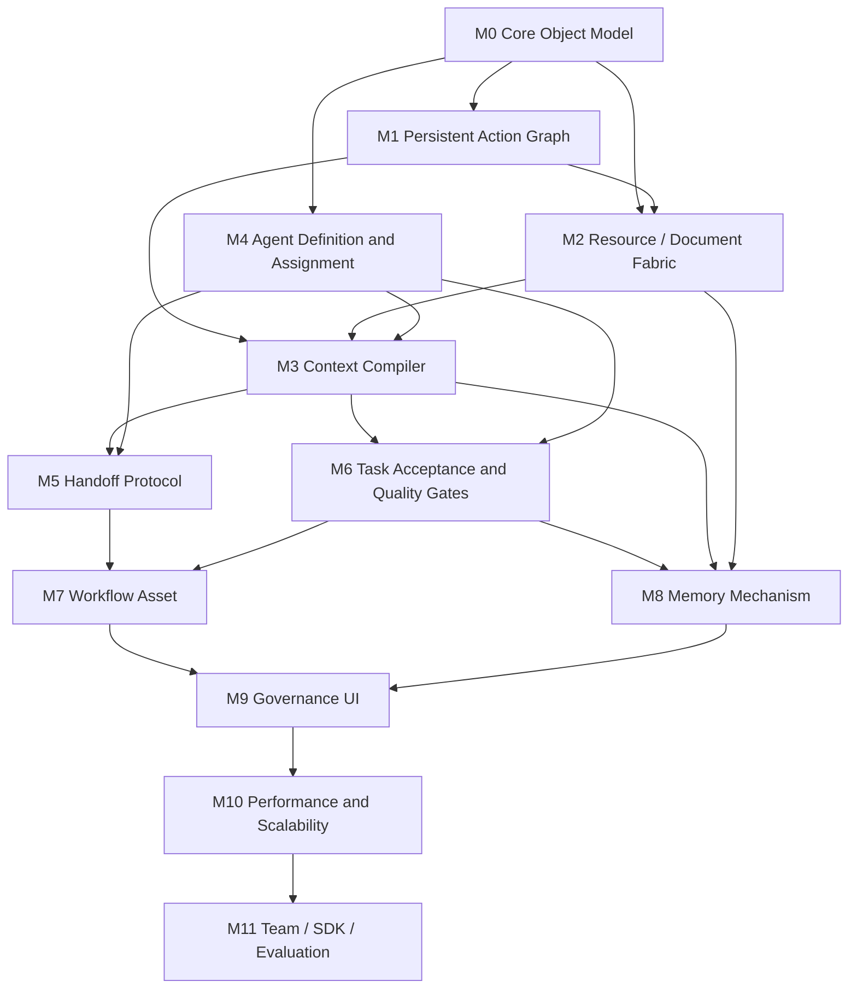

# v2 执行顺序、Worktree 与 Prompt

## 1. 执行原则

每个里程碑使用一个独立 worktree 和一个独立分支。新会话只负责一个里程碑，先读 v2 PRD，再使用 Superpowers 框架生成该里程碑的详细实施计划，然后按计划执行。

默认基线分支是 `dev` 或 `origin/dev`。不要从本地 `main` 开分支。

执行规则：

- 每个 worktree 只实现一个里程碑。
- 共享 schema、状态词、ref 规则和数据库表变更必须先在基础里程碑合并后再展开下游工作。
- 能并行的里程碑并行设计和开发，但合并时按依赖顺序进入 `dev`。
- 每个里程碑完成前必须有测试、类型检查、文档更新和验收说明。
- 新会话必须使用 Superpowers：先 `using-git-worktrees`，再 `writing-plans`，实现时使用 `test-driven-development` 和 `executing-plans`。

## 2. 并行波次

| 波次 | 里程碑 | 是否并行 | 启动条件 | 合并条件 |
|---|---|---:|---|---|
| Wave 0 | M0 Core Object Model | 否 | v2 PRD 已确认。 | 核心 schema、ref、对象边界测试通过。 |
| Wave 1 | M1 Persistent Action Graph | 否 | M0 合并。 | Action Graph 持久化、Event replay、Projection rebuild 可用。 |
| Wave 2 | M2 Resource / Document Fabric、M4 Agent Definition and Assignment | 是 | M0 合并；M2 依赖 M1 的 store 约定，M4 依赖 M0 schema。 | M2 资源层可用；M4 agent assignment 可用。 |
| Wave 3 | M3 Context Compiler、M5 Handoff Protocol、M6 Task Acceptance and Quality Gates | 部分并行 | M1、M2、M4 合并。M3 先启动；M5/M6 可并行设计，代码实现等 M3 refs 接口稳定。 | Context、Handoff、Acceptance 都通过 Resource refs 和 Projection 工作。 |
| Wave 4 | M7 Workflow Asset、M8 Memory Mechanism | 是 | M3、M5、M6 合并。 | Workflow node 能继承验收策略；Memory promotion 能走 acceptance gate。 |
| Wave 5 | M9 Governance UI | 否，可提前原型 | M2-M8 的 Projection contract 稳定。 | UI 能查看 Run、Resource、Agent、Handoff、Workflow、Memory、Acceptance。 |
| Wave 6 | M10 Performance and Scalability | 部分并行 | 容量模型可从 Wave 2 开始；性能实现等 M9 查询路径稳定。 | 大 Run 性能回归通过，关键路径有指标和预算。 |
| Wave 7 | M11 Team / SDK / Evaluation | 是 | M0 schema 稳定后可设计 SDK；完整实现等 M9/M10 稳定。 | SDK、Team、Evaluation 都走统一 Command/Projection/Trace/Resource 路径。 |

## 3. Worktree 规划

从仓库根目录执行。若新会话已经在隔离 worktree 中，按 `superpowers:using-git-worktrees` 的检测结果执行，不要再嵌套创建 worktree。

| 里程碑 | 分支 | Worktree 路径 |
|---|---|---|
| M0 | `feat/v2-m0-core-object-model` | `.worktrees/v2-m0-core-object-model` |
| M1 | `feat/v2-m1-action-graph` | `.worktrees/v2-m1-action-graph` |
| M2 | `feat/v2-m2-resource-fabric` | `.worktrees/v2-m2-resource-fabric` |
| M3 | `feat/v2-m3-context-compiler` | `.worktrees/v2-m3-context-compiler` |
| M4 | `feat/v2-m4-agent-assignment` | `.worktrees/v2-m4-agent-assignment` |
| M5 | `feat/v2-m5-handoff-protocol` | `.worktrees/v2-m5-handoff-protocol` |
| M6 | `feat/v2-m6-acceptance-gates` | `.worktrees/v2-m6-acceptance-gates` |
| M7 | `feat/v2-m7-workflow-asset` | `.worktrees/v2-m7-workflow-asset` |
| M8 | `feat/v2-m8-memory-mechanism` | `.worktrees/v2-m8-memory-mechanism` |
| M9 | `feat/v2-m9-governance-ui` | `.worktrees/v2-m9-governance-ui` |
| M10 | `feat/v2-m10-performance` | `.worktrees/v2-m10-performance` |
| M11 | `feat/v2-m11-team-sdk-eval` | `.worktrees/v2-m11-team-sdk-eval` |

Manual fallback command pattern:

```bash
git fetch origin dev
git worktree add .worktrees/v2-m0-core-object-model -b feat/v2-m0-core-object-model origin/dev
```

If `.worktrees/` is not ignored, add it to `.gitignore` and commit that housekeeping change before creating worktrees.

## 4. Dependency Graph



## 5. Merge Strategy

Suggested merge order:

1. M0
2. M1
3. M2 and M4
4. M3
5. M5 and M6
6. M7 and M8
7. M9
8. M10
9. M11

Parallel branches should frequently rebase or merge `origin/dev` after their dependency branch lands. Do not let M5/M6 define their own incompatible resource ref or context format; they must consume M2/M3 contracts.

## 6. Shared Prompt Prefix

Use this prefix for every new milestone session:

```text
You are working in /Users/jin/github/open-agent-harness.

Use the Superpowers framework:
1. Use superpowers:using-git-worktrees to verify or create an isolated worktree for this milestone.
2. Use superpowers:writing-plans to create a detailed implementation plan before code changes.
3. Use superpowers:test-driven-development for implementation.
4. Use superpowers:executing-plans to execute the written plan.
5. Before finishing, use superpowers:verification-before-completion.

Repo rules:
- Default branch is dev; do not use local main for diffs.
- Tests cannot run from repo root. Run Bun tests and `bun typecheck` from package directories such as packages/opencode or packages/app.
- Prefer Bun APIs and existing repo patterns.
- Keep new identifiers short where clear.
- Do not revert unrelated existing worktree changes.

Read these docs first:
- docs/harness-platform-prd-v2/README.md
- docs/harness-platform-prd-v2/00-v2-scope-and-deltas.md
- docs/harness-platform-prd-v2/01-v2-milestones-and-acceptance.md
- docs/harness-platform-prd-v2/02-execution-worktrees-and-prompts.md

Deliverables:
- Implement only the assigned milestone.
- Add focused tests first, watch them fail, then implement.
- Update v2 docs if the implementation clarifies protocol or acceptance behavior.
- End with exact test/typecheck commands run and results.
```

## 7. Milestone Prompts

### M0 Prompt

```text
Milestone: M0 Core Object Model
Branch: feat/v2-m0-core-object-model
Worktree: .worktrees/v2-m0-core-object-model

Goal: Define the shared v2 object model that downstream milestones consume.

Focus:
- Core object categories: facts, views, evidence, resources, context, policy.
- Stable ids, schema_version, producer, visibility, lifecycle.
- Reference Protocol for resource/document/artifact/action/handoff/trace/projection/memory/snapshot.
- Mapping from v1 Artifact, Context, Memory, Workflow semantics to v2 objects.

Expected output:
- Schema/types and validation tests in the appropriate package.
- A short object relationship doc under docs/harness-platform-prd-v2/ if useful.
- No feature-specific runtime behavior beyond shared contracts.
```

### M1 Prompt

```text
Milestone: M1 Persistent Action Graph
Branch: feat/v2-m1-action-graph
Worktree: .worktrees/v2-m1-action-graph

Goal: Persist accepted Action Graphs so runs can be inspected and recovered.

Start only after M0 contracts are merged or available in this worktree.

Focus:
- Persist Run, Action Graph, Action records, dependency edges and node status.
- Append Event records and rebuild Projection from accepted facts.
- Support idempotency, resource lock, cancellation and retry policy fields.
- Expose query methods needed by future Resource, Context, Workflow and UI work.

Expected output:
- Failing tests for graph persistence, dependency recovery and projection rebuild.
- Minimal runtime/store implementation.
- Package-level tests and typecheck from the right package directory.
```

### M2 Prompt

```text
Milestone: M2 Resource / Document Fabric
Branch: feat/v2-m2-resource-fabric
Worktree: .worktrees/v2-m2-resource-fabric

Goal: Move large content and intermediate process records into Resource / Document storage.

Start after M0; integrate with M1 graph/event contracts when available.

Focus:
- Resource Index fields: id, kind, uri, summary, producer, source action, visibility, evidence, lifecycle, timestamps.
- Document writer for model long output, tool output, review report, test report, research note, handoff state and context snapshot.
- Session messages should store summaries and refs for large content.
- Preview, summary, full read, redacted export and tombstone behavior.

Expected output:
- Tests proving large content becomes Resource refs instead of raw session context.
- Resource read/write API and index behavior.
- Docs for Resource lifecycle and ref behavior.
```

### M3 Prompt

```text
Milestone: M3 Context Compiler
Branch: feat/v2-m3-context-compiler
Worktree: .worktrees/v2-m3-context-compiler

Goal: Compile model context from Projection, Resource refs, Handoff refs, Memory refs and user input.

Start after M1, M2 and M4 contracts are available. If M4 is not merged, use M0/M1/M2 contracts and keep Agent-specific hooks narrow.

Focus:
- Context Bundle included/excluded records, summary, refs, token budget and visibility.
- Ref expansion modes: summary, structured, full, on_failure, on_demand, adaptive.
- Privacy, freshness, safety and token-budget based downgrades.
- Context preview explaining why records entered or were excluded.

Expected output:
- Tests for ref expansion budget, excluded records and visibility downgrade.
- Runtime compiler API usable by Agent Session, Handoff, Memory and UI.
```

### M4 Prompt

```text
Milestone: M4 Agent Definition and Assignment
Branch: feat/v2-m4-agent-assignment
Worktree: .worktrees/v2-m4-agent-assignment

Goal: Make Agent templates and Agent Sessions first-class Runtime objects.

Start after M0 contracts are available.

Focus:
- Agent Template metadata: identity, kind, entry, capability, permission, model_preference, execution_mode, relationships, orchestration_policy.
- Agent kind values: planner, worker, verifier, helper.
- Assignment creation for type: "agent" actions.
- Agent Session separated from Agent Template and bound to assignment, authority, Context Bundle summary and Trace refs.
- Routing uses entry, capability, permission, relationships, availability, budget and Projection.

Expected output:
- Tests for metadata validation, routing candidate filtering and assignment/session creation.
- Migration path for existing package/user/project agent configs.
```

### M5 Prompt

```text
Milestone: M5 Handoff Protocol
Branch: feat/v2-m5-handoff-protocol
Worktree: .worktrees/v2-m5-handoff-protocol

Goal: Implement assign, handoff and sync as persisted communication records using refs.

Start after M3 and M4 contracts are available.

Focus:
- Canonical Handoff Record for assign, handoff and sync.
- assignment_builder, handoff_writer and sync_normalizer boundaries.
- Records store source, target, summary, state, evidence, risks, unresolved, next and refs.
- Downstream Agent receives handoff_ref, resource refs, projection ref and trace ref; Context Compiler builds the final context.

Expected output:
- Tests for assign, handoff, sync records and downstream context refs.
- Repair/review/verify/manual switch/context limit/recovery examples.
```

### M6 Prompt

```text
Milestone: M6 Task Acceptance and Quality Gates
Branch: feat/v2-m6-acceptance-gates
Worktree: .worktrees/v2-m6-acceptance-gates

Goal: Ensure every Run, Action Graph, Action, Assignment and Workflow node has Acceptance Criteria and an Acceptance Policy.

Start after M3 and M4 contracts are available. Coordinate with M5 for handoff acceptance.

Focus:
- Acceptance Criteria binding for Run, Action Graph, Action, Assignment, Workflow node and Resource.
- Acceptance Policy generation from criteria, risk, side_effects, resource scope, artifact type, agent kind, permission and user/team policy.
- Acceptance Gate results: approved, changes_requested, needs_evidence, needs_user_decision, blocked, waived.
- Repair assignment routing for changes_requested.
- Prevent completed state when required gates are not satisfied.

Expected output:
- Tests for automatic, test, agent, human, combined and sampled acceptance.
- Projection and Trace entries for acceptance state.
```

### M7 Prompt

```text
Milestone: M7 Workflow Asset
Branch: feat/v2-m7-workflow-asset
Worktree: .worktrees/v2-m7-workflow-asset

Goal: Make Workflow a saved, versioned, recoverable Action Graph Profile.

Start after M5 and M6 are available.

Focus:
- Workflow Profile fields: goal, inputs_schema, nodes, depends_on, criteria, failure, gate, loop, budget, artifacts, visibility, handoff.
- Workflow asset metadata: owner, version, source, visibility, created_at, updated_at.
- Workflow Run expands to normal Action Graph and uses Event, Projection, Trace, Resource and Acceptance Gate paths.
- Failed node operations: inspect evidence, retry, skip, create repair assignment or request user decision.

Expected output:
- Tests for save-from-run, run-from-profile, node recovery and acceptance inheritance.
```

### M8 Prompt

```text
Milestone: M8 Memory Mechanism
Branch: feat/v2-m8-memory-mechanism
Worktree: .worktrees/v2-m8-memory-mechanism

Goal: Implement scoped Memory records derived from Resource, Trace, Sync, explicit user save and Workflow recap.

Start after M2, M3 and M6 are available.

Focus:
- Memory scopes: run, project, team, global.
- Memory fields: summary, scope, namespace, source refs, evidence refs, visibility, status, freshness.
- Candidate review and acceptance gate before promotion.
- Scope precedence: current Projection overrides historical Memory.
- Context Compiler integration.

Expected output:
- Tests for candidate generation, promotion gating, scope precedence and context use.
```

### M9 Prompt

```text
Milestone: M9 Governance UI
Branch: feat/v2-m9-governance-ui
Worktree: .worktrees/v2-m9-governance-ui

Goal: Build UI surfaces for the v2 governed runtime objects.

Start after M2-M8 Projection contracts are stable. If backend work is still landing, begin with typed fixtures and replace with real queries after contracts merge.

Focus:
- Run Console.
- Resource Explorer.
- Agent Manager.
- Handoff View.
- Workflow Panel.
- Memory Panel.
- Acceptance View.

Expected output:
- UI tests for each panel's empty, loading, populated, blocked and error states.
- No raw transcript as default state source; UI reads Projection, Trace and Resource summaries.
```

### M10 Prompt

```text
Milestone: M10 Performance and Scalability
Branch: feat/v2-m10-performance
Worktree: .worktrees/v2-m10-performance

Goal: Establish performance budgets and optimize high-data and high-concurrency paths.

Start capacity-model work early after M2; start implementation after M9 query paths are stable.

Focus:
- Capacity model for Event, Action Graph, Trace, Acceptance Records, Resource, Memory, Session Tree, Projection, Scheduler, Executor, Context Compiler and UI Subscription.
- Pagination, indexes, summaries, hot/cold storage and lazy loading.
- Scheduler backpressure, concurrency limits, timeout, cancellation and retry metrics.
- Performance regression test with at least 500 events, 100 actions, 50 resources, 10 child sessions, 20 acceptance records and 3 concurrent Agent Sessions.

Expected output:
- Performance tests and metrics.
- UI first-screen budgets for Run list, Action Graph, Trace Timeline, Acceptance View, Resource Explorer and Workflow Panel.
```

### M11 Prompt

```text
Milestone: M11 Team / SDK / Evaluation
Branch: feat/v2-m11-team-sdk-eval
Worktree: .worktrees/v2-m11-team-sdk-eval

Goal: Expose v2 Runtime capabilities for team, SDK and evaluation use.

Start SDK design after M0; start full implementation after M9/M10 stabilize.

Focus:
- Local SQLite and team PostgreSQL / object storage adapter boundary.
- Permissions for user, project, team, agent, resource and trace export.
- SDK for Command, Projection query, Trace export, Agent, Workflow, Memory and Resource management.
- Evaluation Adapter using Trace, Resource, Outcome, Metric and Regression Gate.
- Model Policy for provider, model, budget, fallback, cache and context budget.

Expected output:
- SDK tests and API compatibility tests.
- Evaluation fixtures using v2 Trace and Resource records.
```
