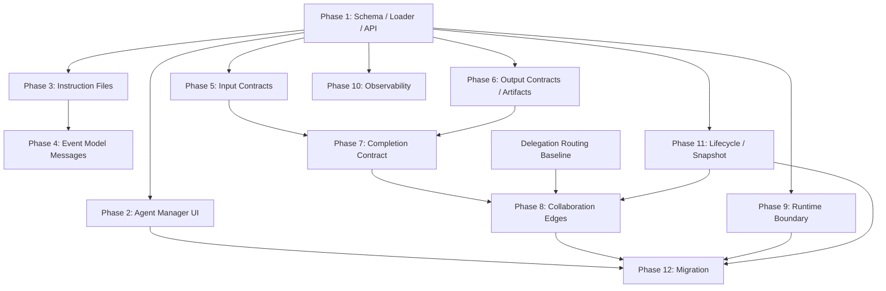

# Agent Metadata RFC Execution Orchestration

Status: Draft

Date: 2026-06-02

Related:

- `10-agent-metadata-rfc.md`
- `11-agent-metadata-implementation-plan.md`

## Goal

This document turns the Agent Metadata RFC implementation plan into an execution schedule. It defines phase order, parallel work windows, PR boundaries, handoff rules and worker ownership.

The main constraint is simple: metadata fields can be planned together, but Runtime behavior must be enabled in dependency order. Schema, loader and API compatibility come first because every later phase depends on stable normalized metadata and diagnostics.

## Current Coordination Rule

The working tree already contains implementation changes outside this orchestration document. Treat them as active work by another contributor.

Before spawning code-editing workers:

- assign each worker a disjoint write set
- tell each worker not to revert unrelated changes
- require each worker to list changed files
- integrate only after reviewing dirty-file overlap
- run tests from package directories, not the repo root

For the first dispatch wave, use read-only explorer agents. Their job is to produce file-level PR packets and conflict notes. Code-editing workers should start after Phase 1 ownership is confirmed.

## Phase Dependency Graph

## Execution Waves

### Wave 0: Read-Only Split

Purpose: confirm write scopes and avoid conflicts with existing dirty work.

Run these in parallel:

| Agent | Scope | Output |
|---|---|---|
| A | Phase 1 schema, loader, API | PR packets, API impact, diagnostics and test list |
| B | Phase 2 UI and Agent Manager | UI PR packets, form/API dependencies, dirty-file conflicts |
| C | Phase 3/4 instructions and event messages | prompt/event entry points, trace needs, PR packets |
| D | Phase 5/6/7 contracts, artifacts and completion | completion signals, artifact acceptance, PR packets |
| E | Phase 8/9/10/11/12 collaboration, boundary, observability and lifecycle | parallel windows, abstract collaboration model, migration packets |

Parent thread responsibilities:

- keep the RFC and implementation plan as source of truth
- maintain this orchestration document
- decide when to move from explorer agents to worker agents
- review returned packets for file overlap

### Wave 1: Foundation

Run mostly sequentially. Phase 1 is the gating phase.

Recommended PRs:

1. `feat(agent): parse metadata control-plane fields`
   - Write set: `packages/opencode/src/agent/schema.ts`, schema tests.
   - Enables: full field parsing, aliases, v1 defaults.
   - Gate: old agents load; RFC sample parses.
2. `feat(agent): load metadata diagnostics`
   - Write set: `packages/opencode/src/agent/loader.ts`, loader tests.
   - Enables: path/logo/ref diagnostics without Runtime behavior change.
   - Gate: diagnostics include field paths and severities.
3. `feat(agent): expose metadata through manage api`
   - Write set: `packages/opencode/src/agent/manage.ts`, server/API tests, SDK if API shape changes.
   - Enables: UI and downstream clients.
   - Gate: the Agent Manager API round-trips new metadata.

Open question for PR 3: decide whether RFC metadata belongs in the runtime `/agent` list or only in the Agent Manager API. The current safer default is Agent Manager API first, because the runtime list has a smaller `Agent.Info` shape.

Do not start Runtime behavior work until PR 1 and PR 2 are stable. UI mockups can start, but UI save behavior should wait for the API contract.

### Wave 2: Authoring Surface

Run Phase 2 in parallel with Phase 3 after Phase 1 API shape is stable.

Recommended PRs:

1. `feat(app): preserve agent metadata fields`
   - Write set: `packages/app/src/components/settings-agents-helpers.ts` and round-trip tests.
   - Gate: editing common fields does not drop advanced metadata.
2. `feat(app): add metadata overview panels`
   - Write set: `packages/app/src/components/settings-agents.tsx` and adjacent app components.
   - Gate: identity, logo, contracts, collaboration, boundary and lifecycle are visible.
3. `feat(app): add advanced metadata json editor`
   - Write set: Agent Manager helper state, editor component and validation tests.
   - Gate: JSON parse failures block save; server diagnostics are displayed; project/user agents can round-trip RFC fields.
4. `feat(agent): resolve instruction files`
   - Write set: `packages/opencode/src/agent/instructions.ts`, prompt construction tests.
   - Gate: required missing files block; optional missing files warn.

Agent Manager lives in `packages/app`, not `packages/ui`. The current `packages/ui` changes are protocol/message display work and should not be used as the first Phase 2 write scope.

The first UI pass should prefer Overview, Advanced JSON and Diagnostics. Structured editors for contracts, collaboration, runtime boundary and lifecycle should wait until schema/API shapes are stable. The UI can show diagnostics before every Runtime feature exists. Runtime must not treat UI display as authority.

### Wave 3: Runtime Messaging And Contracts

Run Phase 4 and Phase 5 in parallel after Phase 3 and Phase 1.

Recommended PRs:

1. `feat(agent): inject event model messages`
   - Write set: `packages/opencode/src/agent/messages.ts`, runner event hook tests.
   - Gate: injected messages are traceable and do not appear as user messages.
2. `feat(agent): validate input contracts`
   - Write set: `packages/opencode/src/agent/contracts.ts` and contract unit tests.
   - Gate: missing input, wrong artifact type, visibility denied and prerequisite available produce deterministic results.

These PRs can be independent if they share only normalized metadata types. Keep the first input-contract PR mostly pure; assignment/routing hooks should be thin and can be stacked later. If both PRs need runner hooks, land one runner hook PR first, then stack the second.

### Wave 4: Output, Completion, Collaboration

Run Phase 6 first, then Phase 7, then Phase 8. Some tests and UI display can be prepared in parallel, but Runtime state transitions should stay sequential.

Recommended PRs:

1. `feat(agent): introduce artifact records`
   - Write set: `packages/opencode/src/agent/artifact.ts` or equivalent lightweight module, artifact/contract tests.
   - Gate: tool, subagent and protocol results can normalize to expected, available, invalid or missing artifact records.
2. `feat(agent): accept output artifacts by contract`
   - Write set: output validator in `packages/opencode/src/agent/contracts.ts`, a small runner output hook and protocol executor tests.
   - Gate: invalid required output or missing evidence cannot mark assignment completed.
3. `feat(agent): evaluate completion contracts`
   - Write set: `packages/opencode/src/agent/completion.ts`, runner completion decision tests.
   - Gate: model `done` is treated as a candidate, not final authority.
4. `feat(protocol): carry completion decisions through runner`
   - Write set: protocol status/result projection and status mapping tests.
   - Gate: `partial` and `waiting_user` can carry missing artifacts, failed gates and unresolved items.
5. `feat(agent): expand collaboration edges`
   - Write set: collaboration resolver, routing/task tool integration tests.
   - Gate: prerequisite, verifier, fallback and recovery edges can be expanded without direct agent-to-agent messaging.

Collaboration should not begin with only `before` and `after`. Use abstract edge kinds with triggers, targets, limits, dedupe keys and failure policies.

Phase 8 Runtime execution also depends on the current delegation routing baseline. The dirty work around `agent/delegation.ts`, `task.ts`, `runner.ts` and protocol coordinator behavior should either land first or have one explicit owner before collaboration execution starts.

### Wave 5: Boundary, Snapshot, Observability

Run Phase 9, Phase 10 and Phase 11 in parallel after Phase 1, but land a minimal Phase 11 snapshot before broad Phase 8/9 Runtime behavior is enabled. Otherwise active Agent edits can reinterpret old or running assignments.

Recommended PRs:

1. `feat(agent): record minimal agent metadata snapshots`
   - Write set: snapshot module, assignment creation and replay tests.
   - Gate: old runs keep the Agent definition used at run start.
2. `feat(agent): derive runtime boundary candidates`
   - Write set: boundary module, permission merge tests.
   - Gate: metadata can constrain but cannot directly grant authority.
3. `feat(agent): apply observability metadata`
   - Write set: trace/log projection, audit tests.
   - Gate: trace level, redaction and context/artifact summaries are enforced.

Boundary must cover programming and non-programming agents. Resource classes should include filesystem, network, browser, secret, personal data, service, human contact, email, calendar, database, cloud, payment, CRM and messaging.

Observability should reuse existing protocol and session events where possible. It should not create a parallel telemetry vocabulary for delegation, boundary and completion events.

### Wave 6: Migration And E2E

Run after the core Runtime behaviors are merged.

Recommended PRs:

1. `feat(agent): migrate new templates to metadata v1`
   - Write set: built-in generation, new template defaults, migration diagnostics.
   - Gate: legacy templates still run.
2. `test(agent): cover metadata control-plane scenarios`
   - Write set: integration tests for research, dev-test-review and business approval scenarios.
   - Gate: each RFC field category participates in at least one execution path.

Migration can begin as diagnostics earlier, but template generation changes should wait until schema, UI and snapshot behavior are stable.

## PR Count Estimate

| Phase | PR Count | Execution |
|---|---:|---|
| Phase 1 | 3 | mostly sequential |
| Phase 2 | 3-5 | parallel after API shape |
| Phase 3 | 1-2 | parallel with UI |
| Phase 4 | 1-2 | parallel with input contracts |
| Phase 5 | 1-2 | parallel with event messages |
| Phase 6 | 2-3 | before completion |
| Phase 7 | 2-3 | before collaboration |
| Phase 8 | 3-5 | sequential core, parallel tests/UI |
| Phase 9 | 2-4 | parallel after Phase 1 |
| Phase 10 | 1-2 | parallel after Phase 1 |
| Phase 11 | 2-3 | parallel after Phase 1 |
| Phase 12 | 1-2 | late integration |

Expected total: 25-35 PRs.

## Worker Dispatch Rules

Use code-editing workers only when the write set is isolated.

Good first worker assignments:

- Schema worker: `agent/schema.ts` and schema tests only.
- Loader worker: `agent/loader.ts` and loader tests only, after schema types are available.
- UI preservation worker: `packages/app` Agent Manager helper state and tests only, after API shape is available.
- Instruction worker: new `agent/instructions.ts` and prompt integration tests only.
- Boundary worker: new `agent/boundary.ts` and boundary tests only.

Avoid parallel workers that touch these files at the same time:

- `packages/opencode/src/session/runner.ts`
- `packages/opencode/src/session/runtime-tools.ts`
- `packages/opencode/src/tool/task.ts`
- `packages/app/src/components/settings-agents.tsx`
- `packages/app/src/components/settings-agents-helpers.ts`
- `packages/ui/src/components/message-part.tsx`
- `packages/ui/src/components/message-part-protocol.ts`
- generated SDK or built-in agent output

These files should have one owner per PR because they sit on integration paths.

Avoid mixing Phase 2 Agent Manager work with `packages/ui` protocol card work. Those surfaces may both display metadata later, but they are different products of the same control plane.

## Gate Checklist

Before moving from one wave to the next:

- `git status --short` has been reviewed for overlap.
- Each completed worker lists changed files.
- No worker has reverted unrelated changes.
- Tests were run from the package directory.
- Diagnostics include field paths.
- UI round-trip does not drop unknown or advanced metadata.
- Runtime behavior changes have trace events or audit records.
- Completion and collaboration behavior can be explained without relying on prompt wording alone.
- Model `done` is only a completion candidate; required artifacts, evidence, dependencies and gates decide final status.
- Agent Session handoff still goes through Runtime-controlled Action, Assignment or Handoff records.

## Current Subagent Dispatch

The first dispatch wave is read-only:

- A: Schema/Loader/API split.
- B: UI/Agent Manager split.
- C: Prompt/Instructions/Event Messages split.
- D: Contracts/Artifacts/Completion split.
- E: Collaboration/Boundary/Observability/Lifecycle split.

Their reports established these execution corrections:

- Phase 1 is the hard gate: schema, loader, diagnostics and Agent Manager API must land before Runtime behavior.
- Phase 2 writes `packages/app`, while current `packages/ui` dirty changes belong to message/protocol display.
- Phase 5 should start with a pure `contracts.ts` validator and tests; runner hooks come later.
- Phase 6 should introduce artifact records before completion evaluation.
- Phase 8 execution waits for contracts, artifacts, completion and delegation routing baseline.
- A minimal Phase 11 snapshot should land before broad collaboration/boundary execution.

The next action is to choose the first code-editing worker set. The safest first set is one schema worker plus one read-only UI/API reviewer. Starting more code-editing workers before Phase 1 ownership is settled would create avoidable merge conflicts.
