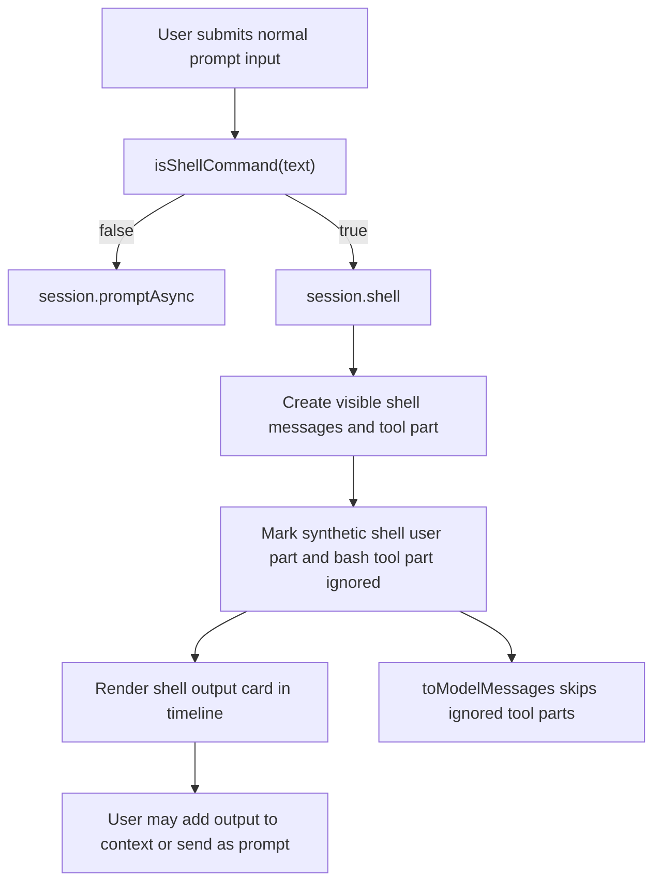

# Session Auto Shell Command Design

## Summary

The session input now detects shell-like user input automatically. If the input is classified as a shell command, the app executes it through the existing session shell path instead of sending it to the model. The shell result is still displayed in the session timeline, but it is excluded from future model context unless the user explicitly opts in.

This replaces the requirement that users manually enter a shell-specific mode for the common case.

## Goals

- Detect common shell commands from the normal prompt input.
- Execute detected commands directly in shell without invoking the model.
- Keep shell execution records visible in the session UI.
- Keep automatic shell execution records out of model context by default.
- Let the user explicitly send the same input to the model instead of executing it.
- Let the user explicitly add shell output to context after reviewing it.
- Add copy and export controls for framed shell output.

## Non-Goals

- Full shell language parsing in the browser.
- Guaranteeing perfect intent detection for all ambiguous English or shell-like text.
- Removing the existing manual shell mode.
- Changing permissions, terminal panes, or agent tool execution semantics outside the session shell flow.

## User-Facing Behavior

When the user types a command such as:

```shell
ls -la
git status --short
bun test src/foo.test.ts
rg foo | head
```

the normal prompt input treats it as a shell command and submits it to shell execution. The primary submit button switches to a terminal icon as a visual signal.

When the input is detected as shell, a secondary button appears:

- `Send to model`: bypasses auto shell execution and sends the text as a normal model prompt.

Shell output is shown in a framed bash output card. The card provides:

- Copy output.
- Export Markdown.
- Export HTML.
- Export PDF.
- Add output to context.
- Send output as a prompt.

## Detection Rules

Detection is intentionally conservative and implemented in `packages/app/src/components/prompt-input/shell-detect.ts`.

The detector returns true when:

- The first token is a known command such as `ls`, `git`, `bun`, `npm`, `rg`, `cat`, `pwd`, `docker`, `kubectl`, etc.
- The input contains shell operators such as `|`, `&&`, `||`, `>`, `>>`, `<`, `2>`, or `2>&1`.
- The input starts with an environment assignment followed by a command.

The detector returns false for natural language such as:

```text
please run the tests
explain git status
帮我看看这个错误
```

Auto shell execution is disabled when the prompt includes images, comment context, or explicit context attachments. Those cases are treated as normal model prompts because they carry non-shell conversational context.

## Architecture

### Frontend Input

`PromptInput` computes an `autoShell` signal from the current prompt text and input state. When true:

- The primary submit icon becomes a terminal icon.
- A secondary `Send to model` button appears.
- Normal submit calls `createPromptSubmit` without forcing a mode, so the submit layer can apply detection.
- `Send to model` calls `handleSubmit(event, { mode: "normal" })`, explicitly bypassing shell execution.

### Submit Flow

`createPromptSubmit` performs the authoritative decision before sending:

1. Read the current prompt text.
2. Check there are no images, comments, or prompt context items.
3. Run `isShellCommand(text)`.
4. If detected, use the existing shell submit path.
5. If explicitly forced to normal mode, send as a normal prompt.

This keeps UI state and submit behavior aligned, while ensuring keyboard submission and button submission use the same decision path.

### Session Shell Storage

The existing `SessionPrompt.shell` path still creates a visible user/assistant shell execution record. The generated shell-related parts are now marked `ignored: true`.

`MessageV2.ToolPart` now supports:

```ts
ignored?: boolean
```

`MessageV2.toModelMessages` skips ignored tool parts when constructing model history. The synthetic user text created for shell execution is also ignored. This preserves timeline visibility while preventing automatic shell output from becoming model context.

### Shell Output Actions

The bash tool renderer receives session actions through `SessionTurn -> AssistantParts -> Part -> ToolPartDisplay -> ToolComponent`.

The bash output card uses those actions to:

- Add shell output to context via `session.prompt(..., noReply: true)`.
- Send shell output as a new prompt via `session.promptAsync(...)`.

Export controls are implemented client-side:

- Markdown export writes a fenced shell block.
- HTML export writes a minimal escaped HTML document.
- PDF export opens a print document for browser PDF output.

## Data Flow



## Context Isolation

The key invariant is:

Automatic shell execution may be visible in the UI, but it must not influence later model calls unless the user explicitly chooses that.

This is enforced by:

- `ignored: true` on shell-created synthetic user text.
- `ignored: true` on shell-created bash tool parts.
- `MessageV2.toModelMessages` skipping ignored tool parts.
- Explicit opt-in actions that create normal prompt/context records only after user action.

## Testing

Coverage added:

- `shell-detect.test.ts`
  - Detects common shell commands.
  - Detects shell operators.
  - Rejects natural language examples.

- `submit.test.ts`
  - Automatically executes detected shell commands from normal mode.
  - Allows detected shell text to be sent as a normal prompt when explicitly forced.

- `message-v2.test.ts`
  - Ensures ignored assistant tool parts are not converted into model messages.

Relevant validation commands:

```shell
bun test src/components/prompt-input/shell-detect.test.ts src/components/prompt-input/submit.test.ts --timeout 30000
bun test test/session/message-v2.test.ts --timeout 30000
bun typecheck
```

Run `bun typecheck` from package directories, not from the repository root.

